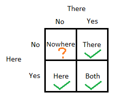
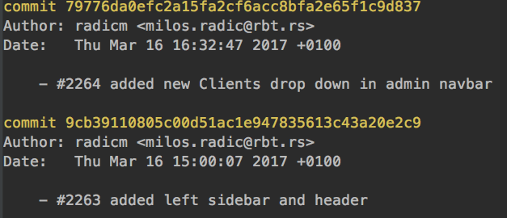
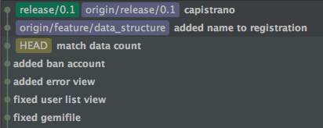
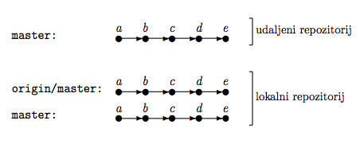

#HSLIDE
### Sistemi za verzionisanje (VCS)

#HSLIDE

### Šta su sistemi za verzionisanje programa / koda?

Alati koji nam omogućavaju vodjnjenje evidnecije izmenama nad projektom bilo da radimo sami ili u grupi. 

#HSLIDE

### Koji sve tipovi sistema postoje?
 Lokalni | Centralizovani | Distribuirani



#HSLIDE
### Uvod u Git


#HSLIDE
###Zašto git?
Jer se u odnosu na druge istakao svojom brzinom, integritetom nad podatcima, distribuiranošću i mogucnošću za nelinearnim tokom rada.

#HSLIDE
###Git VS SVN


#HSLIDE
###Kako je zamišljen?
Kao mreža zasebnih repozitorijuma koji se mogu medjusobno sinhronizovati (distribuiranost), iz toga proističe da svaka izmena koja je napravljena utiče samo na lokalni repozitorijum sve dok se ne izvrši sinhronizacija sa drugim repozitorijumom.

#HSLIDE
###Kako se najčešce koristi?
Kao kombinacija centralizovane i distribuirane mreže gde se sve izmene sinhronizuju preko jednog udaljenog repozitoriujma (Github, Bitbcuket, Gitlab...)git a

#HSLIDE
### Repozitoriujum
Mesto na kome se cuvaju svi commit-ovi sa promenama koje smo do sada napravili. Moze biti lokalni ili udaljeni. Nalazi se u našem projektu u `.git` dorektorijumu.

#HSLIDE
### Commit

Commit predstavlja stanje projekta u odredjenom trenutku. Više povezanih commit-ova formira graf koji predstavlja istoriju našeg projekta.

#HSLIDE
### Dobra praksa  

Commit-ove treba često praviti, gde svaki od njih predstavlja jedinstvenu celinu koja je jednostavna za razumevanje i laka za uklanjanje.

#HSLIDE
### Linerana istorija koda

Idealna situacija u kojoj su se izmene dešavale sekvencialno jedna za drugom. Projekat je zapocet sa stanjem , `a` pa su napravljene izmene `b`, `c`, . . . sve do prve verzije. U ovome nam dosta pomaze komanda `rebase` koju ćemo kasnije opisati.


#HSLIDE
### Grafovi i grananje

Grananje predstavlja nelinearno verzionisanje i ono se predstavlja putem grafova.


#HSLIDE
### Prakticni rad


#HSLIDE

###Rukovanje

```
# zadavnje komandi
git <command> <option 1> <option 2> …

# pomoć
git help <command> …
```

#HSLIDE
###Inicializacija repozitoriuma

```
# inicializacija novog repozitorijuma
$ cd <repo name>
$ git init

# kloniranje postojećeg udaljenog repozitorijuma
$ git clone <https link> or <ssh link>
$ cd <repo name>
```

#HSLIDE
###Konfiguracija

globalna | lokalna | sistemska

```
git config --global
git config config user.name
git config user.email 
...
```

#HSLIDE
###.gitignore

Datoteka u kojoj su navedeni svi direktorijumi i datotoeke koje želimo da izuzmeo iz verzionisanja (.idea, /log, /*.yml...)

#HSLIDE
###Index i commit
Mesto gde se pripremaju izmene za commit


#HSLIDE
```
# dodavanje datoteke u index
$ git add <name>
# prikazivanje trenutnog statusa
$ git status
# prvi commit
$ git commit -m 'Prva izmena'
$ git status
# kači promene na predhodni commit
$ git commit -amend
```

#HSLIDE
### Stash
Mesto za privremeno čuvanje izmena

```
# stash sa podrazumevanim imenom
$ git stash
# stash sa navedenim imenom
$ git stash <-u> <save [name]>
# listavanje svih stash-eva
$ git stash list
```

#HSLIDE
### Uklanjanje promena iz index-a

```
# uklonja iz repozitorijuma ali ostavlja fizicki
$ git rm --cached <name> 
# ukloninja sve izmene do poslednjeg commit-a
$ git checkout . or <name>
```

#HSLIDE
### Uklanjanje commit-a

```
# briše sve commit-ove i njihove promene
$ git reset <commit sha> --hard
# briše sve commit-ove ali ostavlja njihove izmene u index-u
$ git reset <commit sha> --soft
# briše sve commit-ove ali ostavlja izmene u radnom direktorijumu
$ git reset <commit sha> --mixed
# kreira novi commit sa suprotnim promenama
$ git revert
```

#HSLIDE
### Istorija projekta

```
# prikazivanje istorije
$ git log
# formatirana istorija
$ git log --graph --all --oneline --decorate
```



#HSLIDE
### Kretanje kroz commitove

```
# lista istoriju
$ git log
# pozicionira na navedeni commit, tag ili granu
$ git checkout <commit sha> or <tag> or <branch>
# pozicionira na 5 commit od trenutnog
$ git checkout HEAD~5
```

#HSLIDE
### HEAD
Referenca na 'trenutni' SHA1 commit-a na kome se nalazimo



#HSLIDE
### Detached HEAD
Bilo koji checkout na commit koji nije ime grane dovodi do ovog stanja, čak i na SHA1 koji je poslednji na grani (ovo stanje se moze predstaviti kao anonimna grana). Samo checkout na ime lokalne grane izbegava ovo stanje.

```
# rešenje za deached HEAD
$ git checkout develop
```

#HSLIDE
### grananje

```
# lista lokalne grane
$ git branch
# lista lokalne grane i udaljene grane
$ git branch -a
# kreira novu lokalnu granu
$ git branch <name>
# kreira novu lokalnu granu i pozicionira se na nju
$ git checkout -b <name>
```

#HSLIDE


```
# spaja “eksperimentalna-grana” u sadašnju granu
$ git merge experimentalna-grana 
```

#HSLIDE


```
# spaja “varijanta” u sadašnju granu (fast forvard)
$ git merge varijanta  
```


#HSLIDE


```
# postavlja početak “varijanta” na vrh sadašnje grane
$ git rebase varijanta
```

#HSLIDE
### Cherry pick

Preuzima bilo koji commit i primenjuje ga gde god da se trenutno nalazimo, kao rezulat nastaje novi commit sa istim izmenama i drugim SHA id-em.

```
# preuzma ceo commit
$ git cherry-pich <sha>
# preuzma deo commit-a
$ git cherry-pick -n (--no-commit) <sha>
```

#HSLIDE
### Conflict
Nastaju kada git ne ume sam da razreši dve promene koje su se desile na istom dokumentu. Tada se od korisnika zahteva da ručno obriše višak izmena i izvrši commit

```
<<<<<<< HEAD
open an issue
=======
ask your question in IRC.
>>>>>>> branch-a

$ git add <conflict file>
$ git commit
```

#HSLIDE
### Udaljeni repozitorijum


#HSLIDE
### Dodavanje udaljenog repozitorijuma 

```
# Dodavanje novog udaljenog repozitorujma
$ git remote add origin https://github.com/user/repo.git

# Validacija udaljenog repozitorijuma
$ git remote -v
origin  https://github.com/user/repo.git (fetch)
origin  https://github.com/user/repo.git (push)
```

#HSLIDE
### Ispod haube


#HSLIDE
### Preuzimanje izmena
#### fetch <br>


```
$ git fetch <remote repo> <branch>
```


#HSLIDE
#### pull <br>


```
$ git fetch
$ git merge origin/master
# isto kao
$ git pull origin master
```

#HSLIDE
#### pull rebase<br>


```
$ git pull rebase
```

#HSLIDE
### Slanje izmena


```
$ git push <remote repo> <branch>
$ git push origin master
```

#HSLIDE
Situacija u kojoj smo na našoj master grani napravili zimene, ali još neko je pre nas napravio izmene na udaljenoj master grani


```
$ git push
error: failed to push some refs to remote

$ git pull
$ git push
```

#HSLIDE
### Uklanjanje commit-ova iz udaljenog repozitorijuma
Izvodi se tako što se pravi novi commit sa izmenama koje negiraju predhodno poslate

```
# kreira novi commit
$ git revert
# šalje izmene na udaljeni repozitorijum 
$ git push
# briše lokalni commit
$ git reset <sha> --hard
# nasilno prepisuje istoriju udaljenog repozitorijuma
$ git push <branch> -f
```

